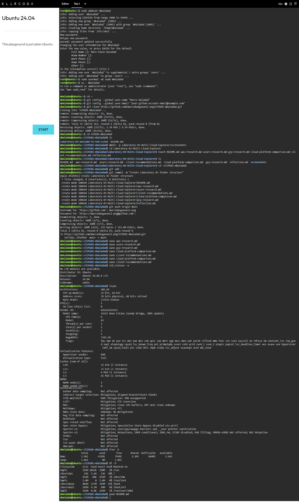

# Laboratory 03 – Multi-Cloud Explorer

## Mission Overview
This activity is about researching and comparing the three major cloud
providers — AWS, Microsoft Azure, and Google Cloud Platform — and
practicing how to recommend the right cloud platform based on a client's
business needs instead of just picking the most popular one.

## Objectives
- Explore the major public cloud platforms.
- Identify core services offered by AWS, Azure, and GCP.
- Compare cloud services across providers.
- Analyze business requirements and recommend appropriate cloud solutions.
- Create professional technical documentation using Markdown.
- Continue developing my GitHub Cloud Computing Portfolio.

## Activities Performed
- Researched AWS, Azure, and GCP official documentation.
- Created individual research files for each platform.
- Built a comparison table and service-matching table.
- Analyzed 4 client scenarios and recommended cloud platforms for each.
- Investigated Linux system information again on KillerCoda.

## Linux Environment Investigation

**Operating System:**

Distributor ID: Ubuntu
Description:    Ubuntu 24.04.4 LTS
Release:        24.04
Codename:       noble

**CPU Information:**

Architecture:          x86_64
CPU(s):                1
Vendor ID:              GenuineIntel
Model name:             Intel Xeon E312xx (Sandy Bridge, IBRS update)
Thread(s) per core:    1
Core(s) per socket:    1
Virtualization type:   full (Hypervisor: KVM)

**Memory:**

              total        used        free      shared  buff/cache   available
Mem:          1.9Gi       432Mi       795Mi       1.1Mi       844Mi       1.4Gi
Swap:         1.0Gi          0B       1.0Gi

**Disk Space:**

Filesystem      Size  Used Avail Use% Mounted on
/dev/vda1        19G  5.4G   13G  30% /

### If this Linux server were migrated to the cloud, which AWS, Azure, and GCP services could host it?
Since this is just a regular Ubuntu Linux server, it could be hosted using the virtual machine service from any of the three providers. On AWS it would run as an Amazon EC2 instance, on Azure it would be an Azure Virtual Machine, and on GCP it would run using Compute Engine. All three basically do the same thing, they let you rent a virtual server where you can install Ubuntu and run it just like this KillerCoda environment, except it stays online permanently instead of being temporary.

## Skills Learned
- Comparing cloud provider services and pricing models.
- Matching business requirements to technical solutions.
- Writing professional technical documentation in Markdown.
- Relating a Linux environment to real cloud virtual machine services.
