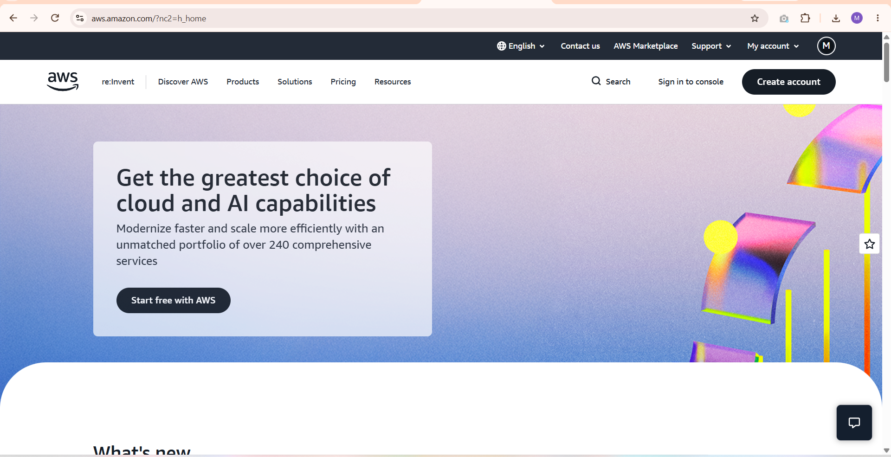

# AWS Research

## Brief Overview
AWS (Amazon Web Services) is the cloud computing service owned by Amazon. It's basically Amazon renting out their computers, storage, and other tech infrastructure over the internet so companies don't have to build and maintain their own servers.

## Global Infrastructure
AWS has data centers all over the world. As of now they have around 39 regions (a region is just a location like "US East" or "Asia Pacific Tokyo") and over 120 availability zones, which are separate data centers inside each region so if one goes down, the others can keep things running.

## Cloud Management Console
It's called the **AWS Management Console**. It's a website where you log in and can see and control all your AWS services in one place, like launching a server, checking storage, or looking at billing, all through clickable menus instead of typing commands.

## Four (4) Core Services
1. **Amazon EC2** – lets you rent virtual servers to run your apps or websites.
2. **Amazon S3** – used for storing files and data in the cloud, like a giant online storage drive.
3. **Amazon RDS** – a managed database service so you don't have to set up and maintain your own database server.
4. **AWS Lambda** – lets you run small pieces of code without managing a server at all, it only runs when triggered.

## Three (3) Advantages
1. It has the most services and features compared to other cloud providers since it's been around the longest.
2. It's very reliable because of how many data centers and availability zones it has worldwide.
3. It can scale up or down depending on how much traffic or workload you have, so you only pay for what you use.

## Typical Enterprise Use Cases
Big companies use AWS for hosting websites and apps that need to handle a lot of users, storing huge amounts of data, and running AI or machine learning workloads. Startups also use it a lot since you can start small and scale up as the business grows without needing to buy your own servers.

## Screenshot

