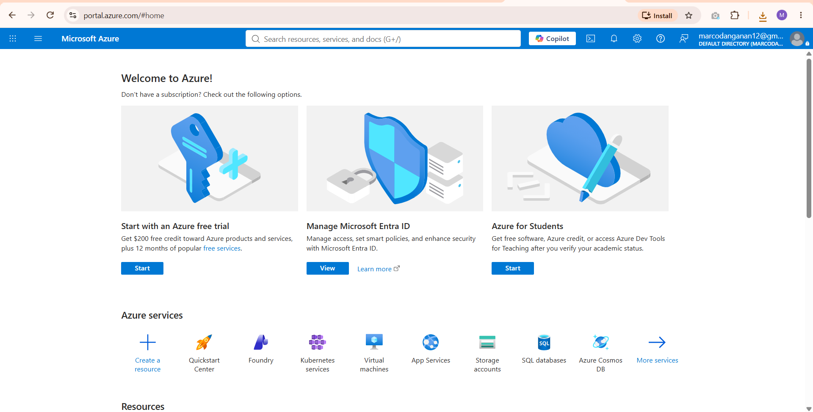

# Microsoft Azure Research

## Brief Overview
Microsoft Azure is Microsoft's cloud computing platform. Just like AWS, it lets companies rent servers, storage, and other computing stuff from Microsoft instead of buying and running their own hardware. It's really popular with businesses that already use Microsoft products.

## Global Infrastructure
Azure has over 70 regions around the world, which is actually more than any other cloud provider. Each region is a group of data centers in one area, and Microsoft says many of these regions also have availability zones so if one part goes down, your service can still keep running from another part.

## Cloud Management Console
It's called the **Azure Portal**. It's a website where you log in and manage everything, like creating virtual machines, checking your storage, or looking at your billing, all through a dashboard with menus and buttons instead of typing commands every time.

## Four (4) Core Services
1. **Azure Virtual Machines** – lets you rent virtual servers to run apps, websites, or anything you need, similar to AWS EC2.
2. **Azure Blob Storage** – used for storing files and data in the cloud, like AWS S3 but for Azure.
3. **Azure Active Directory (Entra ID)** – manages user accounts, logins, and permissions, especially useful for companies that already use Microsoft accounts.
4. **Azure SQL Database** – a managed database service so you don't have to install and maintain your own database server.

## Three (3) Advantages
1. It connects really well with other Microsoft products like Windows Server, Microsoft 365, and Active Directory, so companies already using Microsoft software can integrate easily.
2. It has a huge number of regions worldwide, which makes it easier to keep data close to users and follow local data rules.
3. It offers hybrid cloud options, meaning a company can keep some systems on their own servers and connect them to Azure at the same time.

## Typical Enterprise Use Cases
Companies that already rely on Microsoft tools like Windows Server, Outlook, or Active Directory usually pick Azure because it's easier to connect everything together. Schools, government offices, and big corporations also use Azure a lot since it offers strong security and compliance features needed for those types of organizations.

## Screenshot

