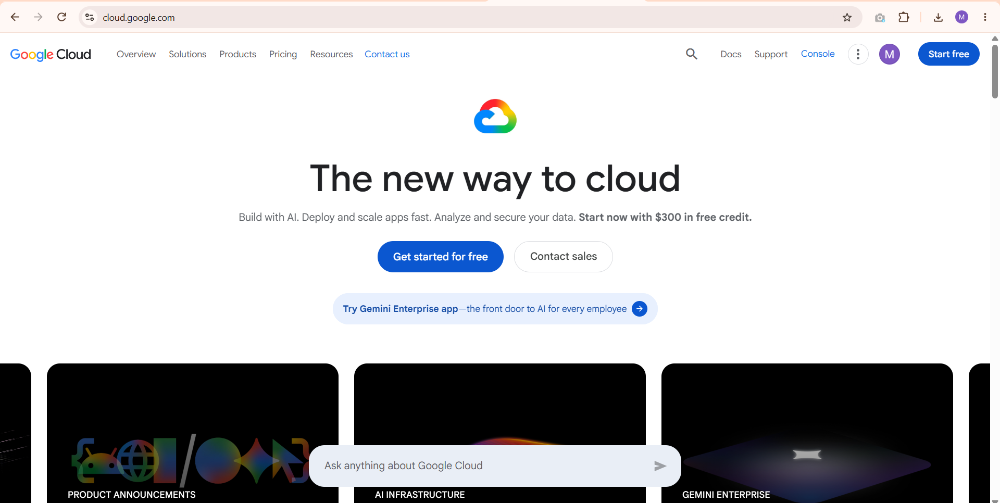

# Google Cloud Platform Research

## Brief Overview
Google Cloud Platform (GCP) is Google's cloud computing service. It gives companies access to the same kind of infrastructure Google uses for products like Search and YouTube, letting them rent servers, storage, and other computing resources instead of building their own.

## Global Infrastructure
GCP has around 43 regions and over 130 zones across the world. A region is a general area like "us-central1" and each region has multiple zones inside it, so if one zone has a problem, apps can keep running from another zone nearby.

## Cloud Management Console
It's called the **Google Cloud Console**. It's a web dashboard where you can manage all your GCP resources like virtual machines, storage buckets, and databases through menus and buttons instead of only using command line tools.

## Four (4) Core Services
1. **Compute Engine** – lets you create and run virtual machines in the cloud, similar to AWS EC2 or Azure VMs.
2. **Cloud Storage** – used for storing files and data, like Google's version of AWS S3.
3. **BigQuery** – a tool for analyzing huge amounts of data really fast, popular for data analytics and reporting.
4. **Google Kubernetes Engine (GKE)** – makes it easier to run and manage containerized apps using Kubernetes.

## Three (3) Advantages
1. It's really strong in data analytics and AI/machine learning tools since Google has a lot of experience building AI products.
2. Its network is one of the fastest since Google owns most of its own fiber optic cables connecting data centers worldwide.
3. It's usually considered easier to use for Kubernetes since Google actually created Kubernetes in the first place.

## Typical Enterprise Use Cases
Companies that work a lot with big data, analytics, or AI/machine learning projects tend to prefer GCP because of tools like BigQuery and its strong AI services. Tech startups and companies building apps that use containers or Kubernetes also like GCP since it was built by the same team behind Kubernetes.

## Screenshot

